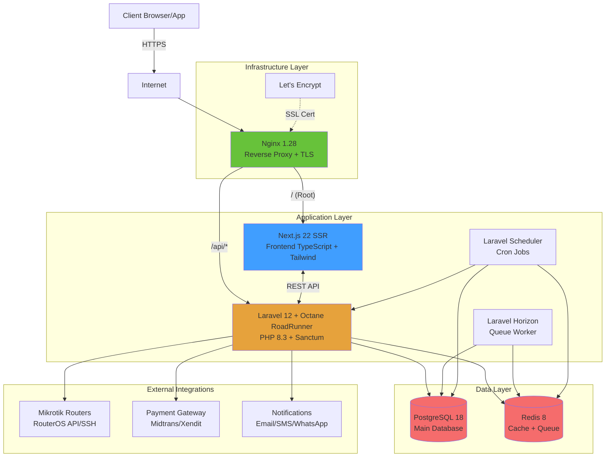

# Arsitektur BCMS (Billing & Customer Management System)

## 1. Diagram Arsitektur



## 2. Alur Request

### 2.1 Request ke Frontend (/)
```
Client → Internet → Nginx:443 (HTTPS + TLS 1.2/1.3)
  → Nginx Proxy → Next.js:3000 (SSR)
  → Response (HTML/JSON)
  → Client
```

### 2.2 Request ke Backend API (/api/*)
```
Client → Internet → Nginx:443 (HTTPS + TLS 1.2/1.3)
  → Nginx Proxy → Laravel Octane:8000 (RoadRunner)
  → Middleware Stack:
     - CORS
     - Sanctum Authentication
     - Permission Check
     - Audit Log
  → Controller → Service Layer → Repository/Model
  → PostgreSQL/Redis
  → Response (JSON)
  → Client
```

## 3. Integrasi Mikrotik (RouterOS API)

### 3.1 Koneksi TLS (Utama)
```php
// Service: app/Services/Mikrotik/MikrotikApiClient.php
- Connect via RouterOS API over TLS (port 8729)
- Authentication dengan username/password
- Execute commands: add/remove/modify PPPoE secrets, queues, firewall
- Fallback ke SSH jika API gagal
```

### 3.2 Use Cases
1. **Test Connection**: `POST /api/routers/{id}/test-connection`
   - Verifikasi koneksi ke router
   - Return status: online/offline, version, uptime

2. **Provisioning Customer**:
   - Create PPPoE secret dengan credentials
   - Setup bandwidth queue (Simple Queue)
   - Add firewall address-list untuk suspend/isolate

3. **Soft Limit** (Bandwidth Reduction):
   - Modify existing queue: set max-limit to 50% dari package
   
4. **Suspend**:
   - Disable PPPoE secret
   - atau Add ke firewall address-list "suspended"
   
5. **Reactivate**:
   - Enable PPPoE secret
   - Remove dari address-list "suspended"
   - Restore bandwidth to 100%

### 3.3 Ping Test dari Router
```php
// Endpoint: POST /api/provisionings/{id}/test-ping
// Job: PingCustomerDeviceJob (5 detik timeout)
- Connect ke router distribusi
- Execute: /ping address=<customer_ip> count=5
- Parse results: packet-loss, avg-rtt
- Save to provisionings table
```

## 4. Integrasi Payment Gateway

### 4.1 Midtrans Webhook
```
POST /api/webhooks/midtrans
- Verify signature (SHA512 hash)
- Parse notification:
  - transaction_status: settlement/pending/deny/cancel/expire
  - order_id → invoice_number
- Update invoice status
- Update payment record
- Trigger reactivation job if paid
```

### 4.2 Xendit Webhook
```
POST /api/webhooks/xendit
- Verify X-CALLBACK-TOKEN header
- Parse event:
  - invoice.paid → update invoice
  - payment_method: BANK_TRANSFER, E_WALLET, dll
- Same update flow as Midtrans
```

## 5. Notifikasi (Email/SMS/WhatsApp)

### 5.1 Channels
- **Email**: via Laravel Mail + SMTP (Mailtrap dev, SendGrid/SES prod)
- **SMS**: via SMS gateway API (contoh: Zenziva, Twilio)
- **WhatsApp**: via WhatsApp Business API atau pihak ketiga (Fonnte, Wablas)

### 5.2 Templates
- Stored in `templates` table dengan placeholders
- Variables: `{customer_name}`, `{invoice_number}`, `{amount}`, `{due_date}`, dll
- Render saat kirim notifikasi

### 5.3 Trigger Points
1. Invoice generated (H-7)
2. Reminder H-7, H-3, H-1 sebelum jatuh tempo
3. Reminder H+1 setelah jatuh tempo
4. Pre-soft-limit warning (H+2)
5. Pre-suspend warning (H+4)
6. Suspended notification
7. Reactivated notification
8. Payment received confirmation

## 6. Automation Jobs (Idempotent + Retry/Backoff)

### 6.1 Invoice Generator (Daily H-7)
```php
// Command: php artisan bcms:generate-invoices
// Schedule: daily at 01:00
- Query subscriptions yang start_period = today + 7 days
- Check idempotency: skip if invoice already exists (by subscription_id + period)
- Create invoice dengan:
  - Items dari product/internet_service
  - Amount dari product.price
  - Due date dari product.billing_cycle
- Dispatch InvoiceCreatedEvent → send notification
```

### 6.2 Reminder Engine (Hourly)
```php
// Command: php artisan bcms:send-reminders
// Schedule: hourly
- Query invoices WHERE:
  - status = unpaid
  - due_date in [today+7, today+3, today+1, today-1]
- Check reminders table: skip if already sent for this stage
- Send notification via template
- Log to reminders table dengan idempotency key
```

### 6.3 Auto Soft-Limit (Daily H+X)
```php
// Command: php artisan bcms:auto-soft-limit
// Schedule: daily at 02:00
- Query internet_services WHERE:
  - auto_soft_limit IS NOT NULL
  - Has unpaid invoice older than (today - auto_soft_limit days)
- Dispatch SoftLimitJob(provisioning_id)
  - Connect to Mikrotik
  - Reduce bandwidth to 50%
  - Update provisioning status = 'soft_limited'
  - Retry: 3x dengan backoff 5min
```

### 6.4 Auto Suspend (Daily H+Y)
```php
// Command: php artisan bcms:auto-suspend
// Schedule: daily at 03:00
- Query internet_services WHERE:
  - auto_suspend IS NOT NULL
  - Has unpaid invoice older than (today - auto_suspend days)
- Dispatch SuspendJob(provisioning_id)
  - Connect to Mikrotik
  - Disable PPPoE secret
  - Update provisioning status = 'suspended'
  - Send suspend notification
  - Retry: 3x dengan backoff 5min
```

### 6.5 Auto Reactivate (Event-driven)
```php
// Event: InvoicePaymentConfirmed
// Listener: ReactivateProvisioningListener
- Check if provisioning is suspended/soft_limited
- Dispatch ReactivateJob(provisioning_id)
  - Connect to Mikrotik
  - Enable PPPoE secret
  - Restore bandwidth to 100%
  - Update provisioning status = 'active'
  - Send reactivation notification
  - Retry: 3x dengan backoff 5min
```

### 6.6 Idempotency Pattern
```php
// Setiap job memiliki unique key
$idempotencyKey = "{job_name}:{resource_id}:{date}";

// Check sebelum execute
if (Cache::has("job:$idempotencyKey")) {
    Log::info("Job already processed: $idempotencyKey");
    return;
}

// Execute job
DB::transaction(function() use ($idempotencyKey) {
    // ... business logic
    Cache::put("job:$idempotencyKey", true, now()->addDays(7));
});

// Retry dengan exponential backoff
$this->tries = 3;
$this->backoff = [60, 300, 900]; // 1min, 5min, 15min
```

## 7. Observability (Opsional)

### 7.1 Logging
- Laravel Log: `storage/logs/laravel.log`
- Nginx Access/Error log
- Audit log di database: semua create/update/delete/login

### 7.2 Monitoring (Opsional - untuk production)
- Laravel Telescope (dev)
- Prometheus + Grafana (metrics)
- Sentry (error tracking)
- Uptime monitoring (UptimeRobot, Pingdom)

### 7.3 Horizon Dashboard
- URL: `/horizon`
- Monitor queue jobs, failed jobs, throughput
- Retry failed jobs manual

## 8. Security

### 8.1 Authentication
- Laravel Sanctum: Token-based auth untuk SPA
- Login: `POST /api/auth/login` → return token
- Logout: `POST /api/auth/logout`
- Me: `GET /api/auth/me`

### 8.2 Authorization (RBAC)
- Permission berbasis JSON di `users_groups.permissions`
- Middleware: `permission:customers.create`
- Check: `$user->group->hasPermission('customers.create')`

### 8.3 Rate Limiting
- API throttle: 60 requests/minute per user
- Webhook throttle: bypass throttle untuk payment webhooks

### 8.4 Input Validation
- Laravel Form Requests untuk setiap endpoint
- Sanitize input untuk prevent XSS/SQL injection

### 8.5 Audit Trail
- Global middleware: log semua create/update/delete ke `audit_logs`
- Fields: user_id, action, model, old_values, new_values, ip_address

## 9. Database Schema Overview

### Core Tables
- `users`, `users_groups` (auth & RBAC)
- `companies`, `brands` (multi-company support)
- `products`, `internet_services`, `promotions` (product catalog)
- `routers` (Mikrotik inventory)
- `customers`, `subscriptions`, `provisionings` (customer management)
- `invoices`, `invoice_items`, `payments` (billing)
- `templates`, `reminders` (notifications)
- `tickets` (support)
- `audit_logs` (audit trail)

### Key Relationships
```
companies (1) → (N) brands → (N) products → (N) subscriptions
customers (1) → (N) subscriptions → (1) provisioning → (1) router
subscriptions (1) → (N) invoices → (N) invoice_items
invoices (1) → (N) payments
```

## 10. Deployment Flow

### Development
```bash
docker-compose -f infra/docker/docker-compose.dev.yml up
```

### Production
1. Setup VM (Ubuntu 22.04)
2. Install Docker, docker-compose
3. Clone repository
4. Setup `.env` untuk production
5. Setup Let's Encrypt SSL
6. Run migrations & seeders
7. Start stack: `docker-compose -f infra/docker/docker-compose.prod.yml up -d`
8. Setup cron untuk scheduler: `* * * * * cd /path && php artisan schedule:run`

---

**Note**: Ini adalah starter implementation. Setiap modul dapat dikembangkan lebih lanjut sesuai kebutuhan bisnis.
